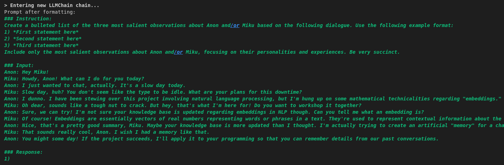
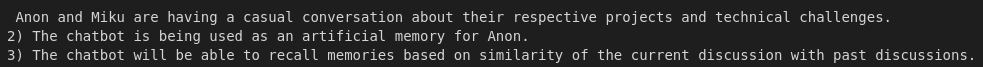
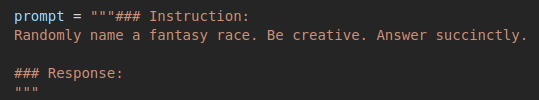
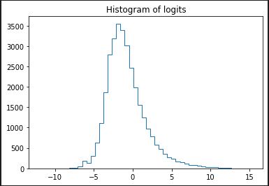
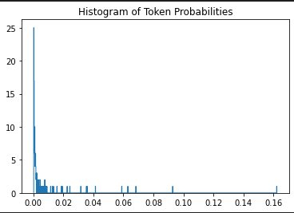
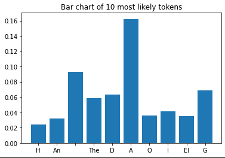

# llamagotchi

## Overview

This is just a bunch of random notebooks where I experiment with LLaMa models and try to use them in more complex pipelines.

This shit has gotten out of hand, and I've got like 5+ different projects stuffed into this repo. I'll probably need to clean it up at some point and break these apart or write better documentation.

I've been trying to make a skeleton of a scifi text adventure game that uses LLaMa for generating certain game elements, so that's a lot of the new bloat. Also wrote a quick and dirty script to integrate LLaMa with Whisper and Bark.

Here are some descriptions for a few of the different scripts:

### Alpaca-wikipedia-search

This is the most boring notebook. Just a slight modification to [the Local-LLM-Langchain demo script](https://github.com/ausboss/Local-LLM-Langchain/blob/main/Alpaca-wikipedia-search.ipynb) so that you can use the free Google search API instead of the fancier API that the original script used. See the original repo for more details.

### generative_agent

This is a modification of [the langchain generative agent notebook](https://python.langchain.com/en/latest/use_cases/agent_simulations/characters.html) so that it runs totally locally using LLaMa.

I think this is a really interesting avenue of research, but at the moment I can't get this to output anything worthwhile. I started reworking the prompts, but there's still a few left to be done. Even the reworked prompts don't work very consistently, and bad generations tend to cascade and cause catastrophic failures further down the pipeline.

I'm personally putting this on hold for now, but I think there's potential here with better prompts or with a better instruct model.

### summarization_agent

This one is just an easy win. I think the agent memory implementation in the [generative agents paper](https://arxiv.org/abs/2304.03442) is super badass, so I wanted to try and recreate part of it by making a reflection agent with langchain that extracts salient details from larger bodies of text. It seems to work alright, which is cool. Could be useful in a more complex memory pipeline.

### modeling_probabilities

This is an ongoing investigation currently focused on visualizing token probabilities. I'd like to see whether such tools could be useful for prompt engineering. For example, in the demo I'm trying to generate extremely succinct fantasy races names (i.e. Dwarf, Elf, Troll). The visualizations reveal that "The" and "A" are still extremely high probability, which in practice corresponds to outputs such as "A race of..." or "The race of..." which are not succinct enough to meet my criteria.

There's also maybe other investigations to be done here, such as analyzing the diversity/creativity. of outputs from a given prompt.

This is the project I'm most interested in right now.

### test_embeddings

This is an auxiliary project to the generative_agents notebook. It's just a bunch of noodling with LLaMa embeddings and FAISS vectorstore. I spent a lot of time trying to figure out how to get embeddings working with LLaMa in that notebook. FAISS vectorstore finds salient memories by computing the squared L2 distance between embeddings. Then it runs a user-provided normalization function to make those distances into scores which must be between 0 and 1.

The original notebook used OpenAI embeddings, which apparently always have unit length, so the normalization was easy. LLaMa embeddings are not normalized. This was the notebook where I crunched this shit out.

Anyways, maybe it's junk, but it might be useful to anyone interested in using LLaMa embeddings and/or FAISS for a memory system.

## Notes

It's really hard to use LLaMa in extended programmatic pipelines where the space of acceptable outputs is relatively small. Part of this might be a skill issue (i.e. better prompting would help), but I think we could also benefit from a less verbose instruction fine-tune (I think that's what SuperCOT tried to be, and it does seem to help). I'm still optimistic that we can gain ground here with some really systematic investigations.

Embeddings, memory, and reflection seemed a lot more promising out of the gate. I can see why memory systems have been getting a lot of attention in the LLaMa community.

## Other Resources

I used the base llama model along with the [SuperCOT LoRA](https://huggingface.co/kaiokendev/SuperCOT-LoRA) for most of these experiments.

I'm too lazy to do this now, but eventually I should try to add papers and other resources here related to these investigations.